# CCS Installation Workflow

This diagram illustrates the installation flow for the `ccs` (claude-code-switch) tool, including initialization, installation, profile setup, and completion steps.

## Workflow Diagram

```mermaid
flowchart TD
    Start([Start Installation]) --> Init[Initialize Configuration<br/>INSTALL_DIR, CCS_DIR, CLAUDE_DIR]

    Init --> DetectMethod{Detect Install Method<br/>ccs file exists?}
    DetectMethod -->|Yes: SCRIPT_DIR/ccs| GitMethod[Method: git]
    DetectMethod -->|No| StandaloneMethod[Method: standalone]

    GitMethod --> CreateDirs[Create Directories<br/>mkdir INSTALL_DIR, CCS_DIR]
    StandaloneMethod --> CheckCurl{curl available?}
    CheckCurl -->|No| ErrorCurl[❌ Error: curl required]
    CheckCurl -->|Yes| CreateDirs

    ErrorCurl --> Exit0([Exit 1])

    CreateDirs --> InstallExec{Install Method?}
    InstallExec -->|Git| InstallGit[Use local ccs from SCRIPT_DIR<br/>chmod +x, ln -sf to INSTALL_DIR]
    InstallExec -->|Standalone| DownloadCCS[Download ccs from GitHub<br/>to CCS_DIR<br/>chmod +x, ln -sf to INSTALL_DIR]

    InstallGit --> CheckSymlink{Symlink Created?}
    DownloadCCS --> CheckDownload{Download success?}
    CheckDownload -->|No| ErrorDownload[❌ Error: Failed to download]
    CheckDownload -->|Yes| CheckSymlink
    ErrorDownload --> Exit5([Exit 1])
    CheckSymlink -->|No| ErrorSymlink[❌ Error: Symlink Failed]
    CheckSymlink -->|Yes| InstallUninstaller

    ErrorSymlink --> Exit1([Exit 1])

    InstallUninstaller{uninstall.sh exists?}
    InstallUninstaller -->|Local file| CopyUninstall[Copy uninstall.sh]
    InstallUninstaller -->|Standalone + curl| FetchUninstall[Fetch from GitHub]
    InstallUninstall -->|Neither| SkipUninstall

    CopyUninstall --> CheckPath
    FetchUninstall --> CheckPath
    SkipUninstall --> CheckPath

    CheckPath{INSTALL_DIR in PATH?}
    CheckPath -->|No| WarnPath[⚠️ Warn: Add to PATH]
    CheckPath -->|Yes| DetectProvider
    WarnPath --> DetectProvider

    DetectProvider[Detect Current Provider<br/>check settings.json] --> ProviderResult{Provider?}
    ProviderResult -->|glm| SetGLM[Provider: glm]
    ProviderResult -->|claude| SetClaude[Provider: claude]
    ProviderResult -->|custom| SetCustom[Provider: custom]
    ProviderResult -->|unknown| SetUnknown[Provider: unknown]

    SetGLM --> CheckProfiles
    SetClaude --> CheckProfiles
    SetCustom --> CheckProfiles
    SetUnknown --> CheckProfiles

    CheckProfiles{Missing Profiles?}
    CheckProfiles -->|GLM missing| CreateGLM
    CheckProfiles -->|Sonnet missing| CreateSonnet
    CheckProfiles -->|Both missing| CreateBoth
    CheckProfiles -->|None missing| CreateCCSConfig

    CreateGLM{Current Provider = glm?}
    CreateGLM -->|Yes| CopyGLMConfig[Copy current config<br/>+ enhance with jq]
    CreateGLM -->|No| CreateGLMTemplate[Create GLM template<br/>+ merge with jq if available]

    CopyGLMConfig --> CheckJQGLM{jq available?}
    CheckJQGLM -->|Yes| EnhanceGLM[Add model settings]
    CheckJQGLM -->|No| CopyAsIsGLM[Copy as-is]
    EnhanceGLM --> AtomicMVGLM
    CopyAsIsGLM --> AtomicMVGLM

    CreateGLMTemplate --> CheckJQTemplate{jq available?}
    CheckJQTemplate -->|Yes| MergeTemplate[Merge with current]
    CheckJQTemplate -->|No| BasicTemplate[Use basic template]
    MergeTemplate --> CheckMerge{Merge success?}
    CheckMerge -->|Yes| AtomicMVGLM[atomic_mv to ~/.ccs/glm.settings.json]
    CheckMerge -->|No| BasicTemplate
    BasicTemplate --> WriteGLM[Write ~/.ccs/glm.settings.json]

    AtomicMVGLM --> CheckAtomicGLM{Move success?}
    CheckAtomicGLM -->|No| ErrorAtomicGLM[❌ Error: Permission denied]
    CheckAtomicGLM -->|Yes| WarnAPIKey
    WriteGLM --> WarnAPIKey[⚠️ Warn: Replace API key]

    ErrorAtomicGLM --> Exit2([Exit 1])

    WarnAPIKey --> CreateSonnet

    CreateBoth --> CreateGLM

    CreateSonnet{Current Provider = claude?}
    CreateSonnet -->|Yes| CopySonnetConfig[Copy current config]
    CreateSonnet -->|No| CreateSonnetTemplate[Create Sonnet template<br/>+ remove custom settings with jq]

    CopySonnetConfig --> WriteSonnet[Write ~/.ccs/sonnet.settings.json]
    CreateSonnetTemplate --> CheckJQSonnet{jq available?}
    CheckJQSonnet -->|Yes| RemoveCustom[Remove ANTHROPIC_BASE_URL, etc.]
    CheckJQSonnet -->|No| BasicSonnet[Use basic template]
    RemoveCustom --> CheckRemove{Remove success?}
    CheckRemove -->|Yes| AtomicMVSonnet[atomic_mv to ~/.ccs/sonnet.settings.json]
    CheckRemove -->|No| BasicSonnet
    BasicSonnet --> WriteSonnet

    AtomicMVSonnet --> CheckAtomicSonnet{Move success?}
    CheckAtomicSonnet -->|No| ErrorAtomicSonnet[❌ Error: Permission denied]
    CheckAtomicSonnet -->|Yes| WriteSonnet

    ErrorAtomicSonnet --> Exit3([Exit 1])

    WriteSonnet --> CreateCCSConfig

    CreateCCSConfig{~/.ccs/config.json exists?}
    CreateCCSConfig -->|No| WriteCCSConfig[Create ~/.ccs/config.json<br/>with profile mappings]
    CreateCCSConfig -->|Yes| SkipCCSConfig[Skip: Already exists]

    WriteCCSConfig --> CheckCCSWrite{Write success?}
    CheckCCSWrite -->|No| ErrorCCSWrite[❌ Error: Permission denied]
    CheckCCSWrite -->|Yes| Complete

    ErrorCCSWrite --> Exit4([Exit 1])
    SkipCCSConfig --> Complete

    Complete[✅ Setup Complete<br/>Display Quick Start Guide] --> End([End])
```

## Key Decision Points

1. **Installation Method**: Detects `ccs` file existence in SCRIPT_DIR (not `.git`)
   - Git install: `ccs` file exists → use local file
   - Standalone: no `ccs` file → download from GitHub
2. **Provider Detection**: Analyzes `~/.claude/settings.json` to determine current provider (glm, claude, custom, unknown)
3. **Profile Creation**: Creates missing profile files based on current provider
4. **jq Enhancement**: Uses jq for JSON manipulation if available, falls back to basic templates
5. **Atomic Operations**: Uses atomic_mv for safe file operations with permission checks

## Error Handling Paths

- curl not available (standalone install) → Exit 1
- GitHub download failure (standalone install) → Exit 1
- Symlink creation failure → Exit 1
- Atomic file move failures (permissions) → Exit 1
- Missing PATH warning (non-fatal)
- Missing API key warning (non-fatal)

## Profile Templates

- **GLM Profile**: Configured for api.z.ai with glm-4.6 model
- **Sonnet Profile**: Default Claude configuration (no custom base URL)
- **CCS Config**: Maps profile shortcuts (glm, son, default) to settings files
