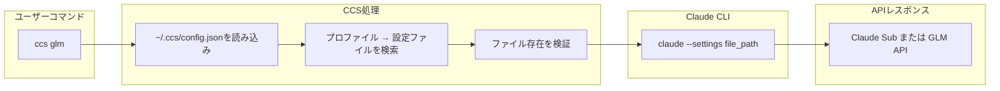

# CCS - Claude Code Switch

<div align="center">


**1つのコマンドで、ダウンタイムなし、タスクごとに最適なモデルを選択**

Claude Sonnet 4.5、GLM 4.6、Kimi for Coding を瞬時に切り替え。レート制限を回避し、コストを最適化。


[](LICENSE)
[]()
[](https://www.npmjs.com/package/@kaitranntt/ccs)
[](https://claudekit.cc?ref=HMNKXOHN)

**Languages**: [English](README.md) | [Tiếng Việt](README.vi.md) | [日本語](README.ja.md)

</div>

---

## 🚀 クイックスタート

### 🔑 前提条件

**CCSをインストールする前に、サブスクリプションアカウントでClaude CLIにログインしていることを確認してください：**
```bash
claude /login
```

### 主なインストール方法

#### オプション1: npmパッケージ（推奨）

**macOS / Linux / Windows**
```bash
npm install -g @kaitranntt/ccs
```

npm、yarn、pnpm、bunパッケージマネージャーと互換性があります。

#### オプション2: 直接インストール（従来型）

**macOS / Linux**
```bash
curl -fsSL ccs.kaitran.ca/install | bash
```

**Windows PowerShell**
```powershell
irm ccs.kaitran.ca/install | iex
```

### 最初の切り替え

```bash
# Claudeサブスクリプションを使用（デフォルト）
ccs "このアーキテクチャ設計をレビューして"

# GLMに切り替えてコスト最適化されたタスクを実行
ccs glm "シンプルなREST APIを作成して"

# Kimiに切り替えて別のオプションを使用
ccs kimi "統合テストを書いて"

# 切り替えが戻されるまで、以降のすべてのコマンドでGLMを使用
ccs glm
ccs "この問題をデバッグして"
ccs "ユニットテストを書いて"
```

#### パッケージマネージャーオプション

主要なパッケージマネージャーすべてに対応：

```bash
# npm（デフォルト）
npm install -g @kaitranntt/ccs

# yarn
yarn global add @kaitranntt/ccs

# pnpm（ディスク使用量70%削減）
pnpm add -g @kaitranntt/ccs

# bun（30倍高速）
bun add -g @kaitranntt/ccs
```

### 設定（自動作成）

**CCSはインストール時に自動的に設定を作成します**（npm postinstallスクリプト経由）。

**~/.ccs/config.json**:
```json
{
  "profiles": {
    "glm": "~/.ccs/glm.settings.json",
    "kimi": "~/.ccs/kimi.settings.json",
    "default": "~/.claude/settings.json"
  }
}
```

### カスタムClaude CLIパス

Claude CLIが標準以外の場所（Dドライブ、カスタムディレクトリ）にインストールされている場合は、`CCS_CLAUDE_PATH`を設定してください：

```bash
export CCS_CLAUDE_PATH="/path/to/claude"              # Unix
$env:CCS_CLAUDE_PATH = "D:\Tools\Claude\claude.exe"   # Windows
```

**詳細な設定手順については、[トラブルシューティングガイド](./docs/en/troubleshooting.md#claude-cli-in-non-standard-location)を参照してください。**

---

## 日常の開発者の課題

Claudeサブスクリプション、GLM Coding Plan、Kimi for Codingを持っている場合、毎日3つのシナリオが発生します：

1. **レート制限に達する**: Claudeがプロジェクト途中で停止 → 手動で`~/.claude/settings.json`を編集
2. **コストの無駄**: 単純なタスクに高価なClaudeを使用 → GLMやKimiで十分
3. **モデル選択**: タスクごとに異なるモデルの強みを活用 → 手動切り替え

手動切り替えはフローを中断します。**CCSはこれを瞬時に解決します**。

## 手動切り替えではなくCCSを使う理由は？

<div align="center">

| 機能 | メリット | 感情的価値 |
|---------|---------|-----------------|
| **即座の切り替え** | 1つのコマンド、ファイル編集不要 | 自信、コントロール |
| **ゼロダウンタイム** | ワークフローを中断しない | 信頼性、一貫性 |
| **スマート委譲** | タスクごとに適切なモデルを自動選択 | シンプルさ、容易さ |
| **コスト管理** | 必要な時だけ高価なモデルを使用 | 効率性、節約 |
| **クロスプラットフォーム** | macOS、Linux、Windowsで動作 | 柔軟性、移植性 |
| **信頼性** | 純粋なbash/PowerShell、依存関係なし | 信頼、安心 |

</div>

**ソリューション**:
```bash
ccs           # Claudeサブスクリプションを使用（デフォルト）
ccs glm       # GLMフォールバックに切り替え
ccs kimi      # Kimi for Codingに切り替え
# レート制限に達した？即座に切り替え：
ccs glm       # GLMで作業を続行
# またはKimiに切り替え：
ccs kimi      # Kimiで作業を続行
```

1つのコマンド。ダウンタイムなし。ファイル編集不要。適切なモデル、適切なタスク。

---

## 🏗️ アーキテクチャ概要



---

## ⚡ 機能

### 即座のプロファイル切り替え
- **1つのコマンド**: `ccs glm`でGLMに切り替え、`ccs`でClaudeサブスクリプションを使用 - 設定ファイルの編集不要
- **スマート検出**: タスクごとに適切なモデルを自動使用
- **永続的**: 再度変更されるまで切り替えは有効

### ワークフロー中断なし
- **ダウンタイムなし**: コマンド間で即座に切り替え
- **コンテキスト保持**: ワークフローは中断されない
- **シームレスな統合**: ネイティブのClaude CLIと全く同じように動作


---

## 💻 使用例

```bash
ccs              # Claudeサブスクリプションを使用（デフォルト）
ccs glm          # GLMフォールバックを使用
ccs kimi         # Kimi for Codingを使用
ccs --version    # CCSバージョンとインストール場所を表示
```

---

### 🗑️ 公式アンインストール

**CCSを完全に削除する推奨方法：**

**macOS / Linux**:
```bash
curl -fsSL ccs.kaitran.ca/uninstall | bash
```

**Windows PowerShell**:
```powershell
irm ccs.kaitran.ca/uninstall | iex
```

> 💡 **公式アンインストーラーを使用する理由は？**
> - すべてのCCSファイルと設定を削除
> - PATH変更をクリーンアップ
> - Claude CLIコマンド/スキルを削除
> - テスト済みのエッジケースに対応

**代替方法**（公式アンインストーラーが失敗した場合）:
- **npm**: `npm uninstall -g @kaitranntt/ccs`
- **手動**: [トラブルシューティングガイド](./docs/en/troubleshooting.md#manual-uninstall)を参照

---

## 🎯 哲学

- **YAGNI**: 「念のため」の機能は追加しない
- **KISS**: シンプルなbash、複雑さなし
- **DRY**: 単一の情報源（設定）

---

## 📖 ドキュメント

**[docs/](./docs/)の完全なドキュメント**:
- [インストールガイド](./docs/en/installation.md)
- [設定](./docs/en/configuration.md)
- [使用例](./docs/en/usage.md)
- [トラブルシューティング](./docs/en/troubleshooting.md)
- [コントリビューション](./docs/en/contributing.md)

---

## 🤝 コントリビューション

コントリビューションを歓迎します！詳細については[コントリビューションガイド](./docs/en/contributing.md)をご覧ください。

---

## 📄 ライセンス

CCSは[MITライセンス](LICENSE)の下でライセンスされています。

---

<div align="center">

**レート制限に頻繁に遭遇する開発者のために ❤️ を込めて作成**

[⭐ このリポジトリにスター](https://github.com/kaitranntt/ccs) | [🐛 問題を報告](https://github.com/kaitranntt/ccs/issues) | [📖 ドキュメントを読む](./docs/en/)

</div>
