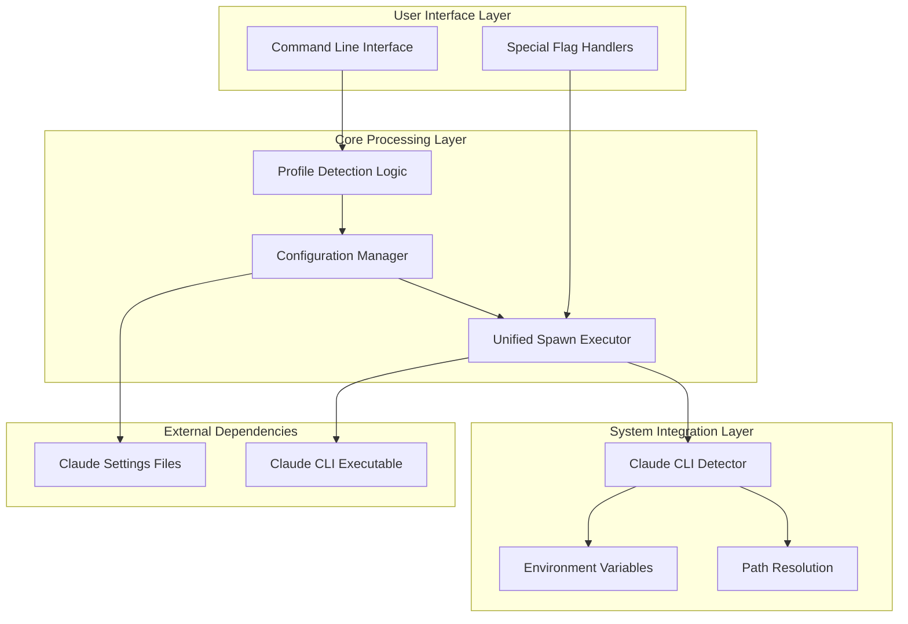
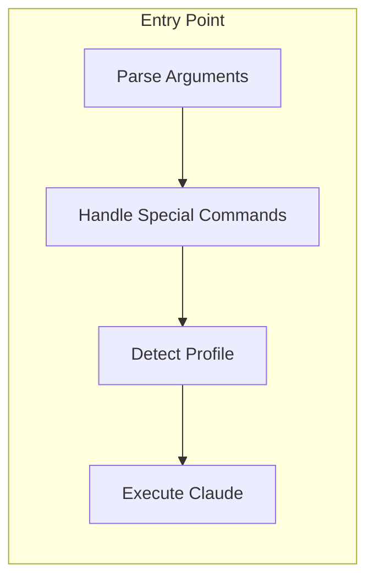
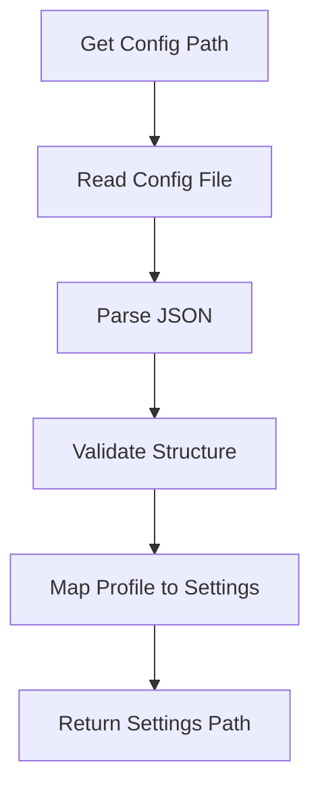
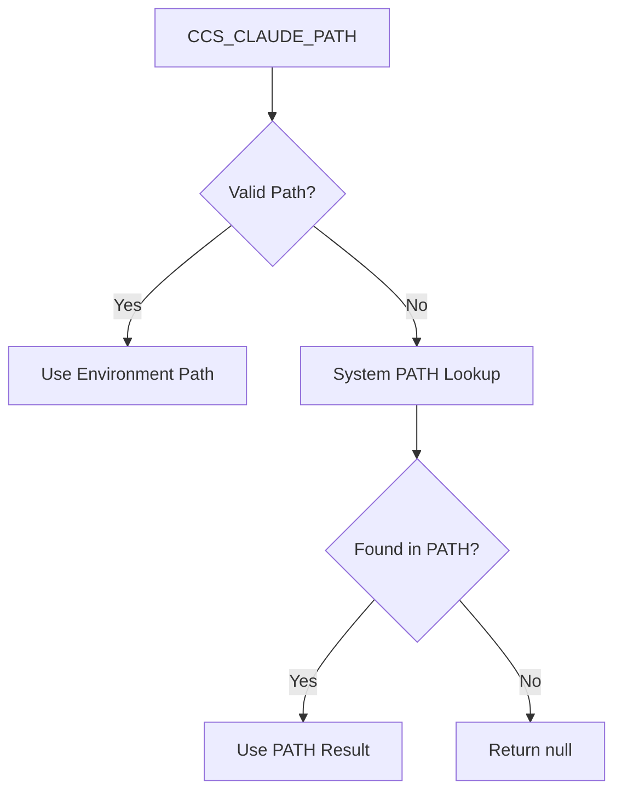
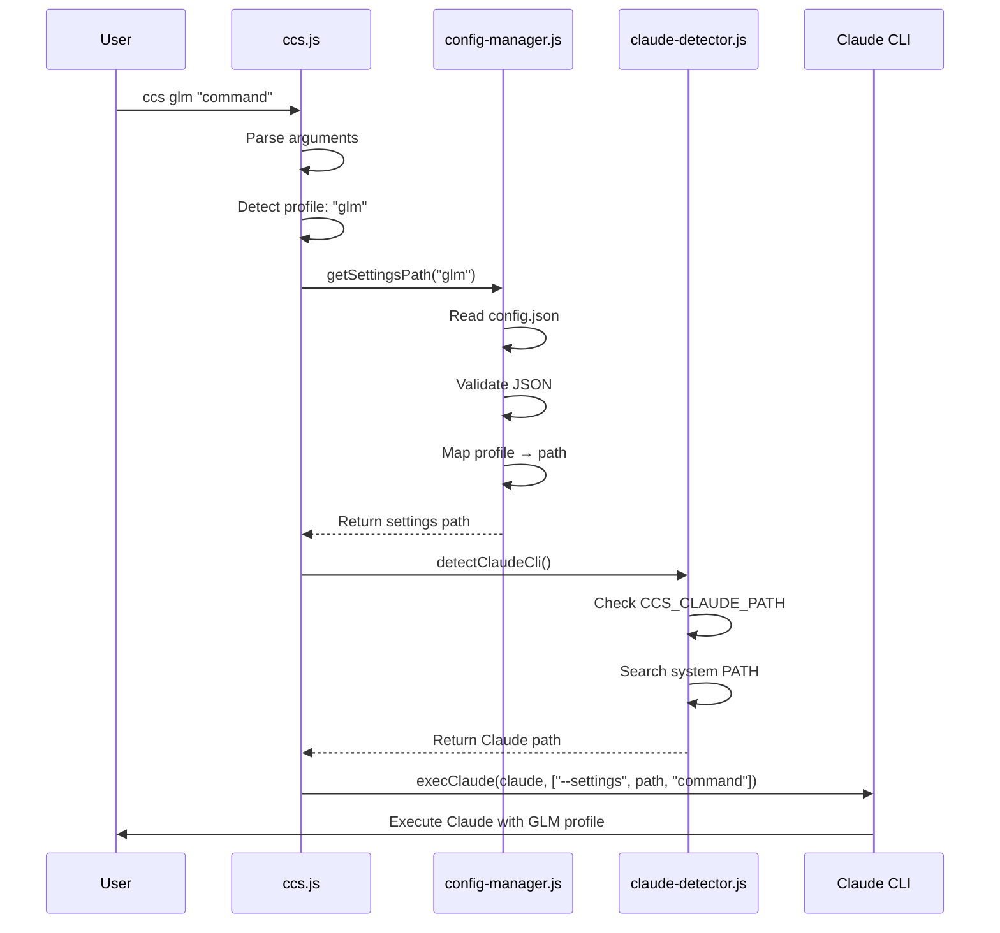
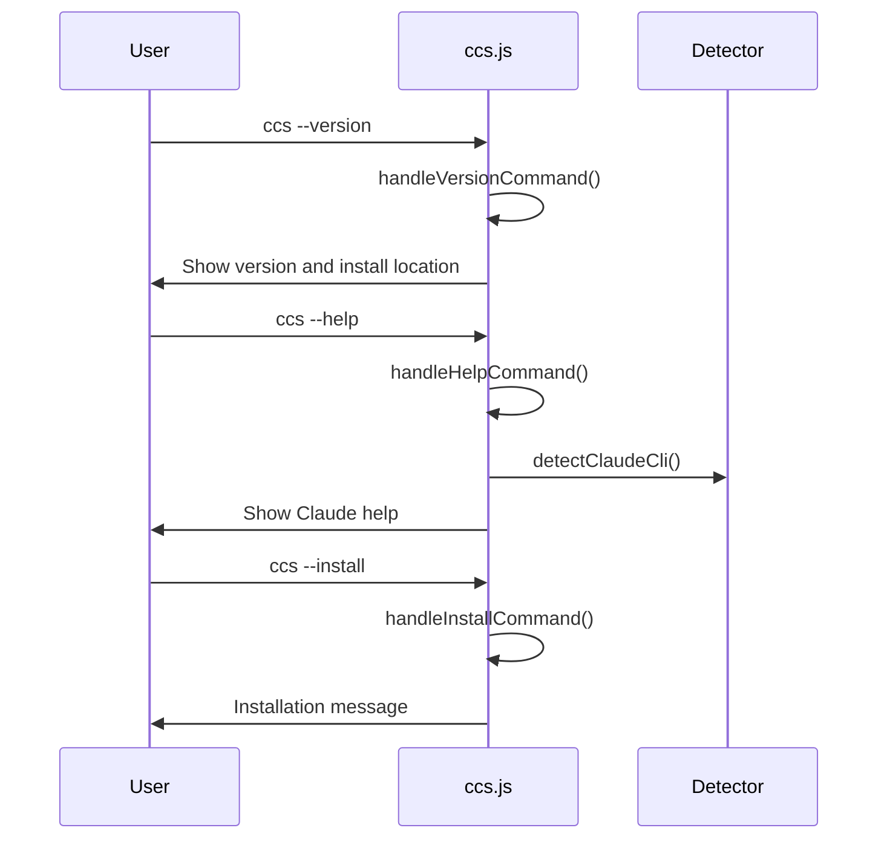
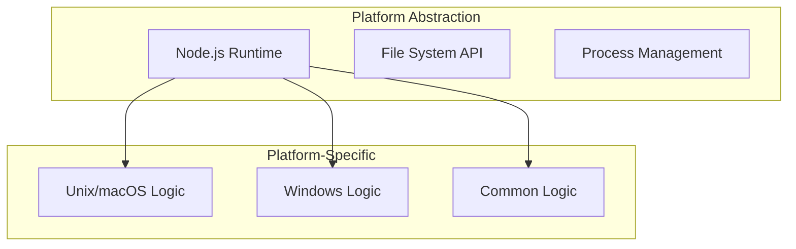
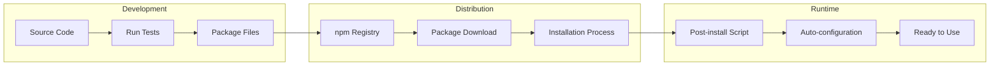

# CCS System Architecture

## Overview

CCS (Claude Code Switch) is a lightweight CLI wrapper that provides instant profile switching between Claude Sonnet 4.5 and GLM 4.6 models. The architecture has been recently simplified to achieve a 35% reduction in codebase size while maintaining all functionality.

## Core Architecture Principles

### Design Philosophy
- **YAGNI** (You Aren't Gonna Need It): No features "just in case"
- **KISS** (Keep It Simple): Minimal complexity, maximum reliability
- **DRY** (Don't Repeat Yourself): Single source of truth for each concern

### Simplification Goals
- Consolidate duplicate logic into reusable functions
- Remove unnecessary validation layers ("security theater")
- Simplify error handling and messaging
- Maintain cross-platform compatibility

## High-Level Architecture



## Component Architecture

### 1. Main Entry Point (`bin/ccs.js`)

**Role**: Central orchestrator for all CCS operations

**Key Responsibilities**:
- Argument parsing and profile detection
- Special command handling (--version, --help) [--install/--uninstall WIP]
- Unified process execution through `execClaude()`
- Error propagation and exit code management

**Simplified Architecture**:


**Critical Simplification**: The `execClaude()` function now provides a single source of truth for all process spawning, eliminating 3 duplicate code blocks.

### 2. Configuration Manager (`bin/config-manager.js`)

**Role**: Handles all configuration-related operations

**Key Responsibilities**:
- Configuration file path resolution
- JSON parsing and validation
- Profile-to-settings-file mapping
- Error handling for configuration issues

**Architecture Flow**:


**Simplified Validation**: Removed redundant validation functions while maintaining essential checks for file existence and JSON validity.

### 3. Claude CLI Detector (`bin/claude-detector.js`)

**Role**: Locates and validates the Claude CLI executable

**Key Responsibilities**:
- Environment variable override support (`CCS_CLAUDE_PATH`)
- System PATH resolution
- Cross-platform executable detection
- Windows-specific executable extension handling

**Detection Priority**:


**Platform-Specific Logic**:
- **Unix/macOS**: Uses `which claude` command
- **Windows**: Uses `where.exe claude` with extension preference
- **Cross-platform**: Unified error handling and fallback logic

### 4. Helpers Module (`bin/helpers.js`)

**Role**: Provides essential utility functions

**Key Responsibilities**:
- TTY-aware color formatting
- Path expansion with tilde and environment variables
- Simplified error reporting
- Cross-platform compatibility

**Removed Functions** (Security Theater):
- `escapeShellArg()`: Unnecessary with spawn() arrays
- `validateProfileName()`: Redundant validation
- `isPathSafe()`: Excessive security checking

## Data Flow Architecture

### Typical Execution Flow



### Special Command Flow



## Configuration Architecture

### File Structure

```
~/.ccs/
├── config.json              # Profile mappings
├── glm.settings.json        # GLM configuration
├── config.json.backup       # Single backup file
└── VERSION                  # Version information
```

### Configuration Schema

```json
{
  "profiles": {
    "default": "~/.claude/settings.json",
    "glm": "~/.ccs/glm.settings.json"
  }
}
```

### Settings File Format

```json
{
  "env": {
    "ANTHROPIC_BASE_URL": "https://api.z.ai/api/anthropic",
    "ANTHROPIC_AUTH_TOKEN": "your_api_key",
    "ANTHROPIC_MODEL": "glm-4.6",
    "ANTHROPIC_DEFAULT_OPUS_MODEL": "glm-4.6",
    "ANTHROPIC_DEFAULT_SONNET_MODEL": "glm-4.6",
    "ANTHROPIC_DEFAULT_HAIKU_MODEL": "glm-4.6"
  }
}
```

## Security Architecture

### Inherent Security Model

1. **No Shell Injection Risk**: Uses `spawn()` with array arguments
2. **No Arbitrary Code Execution**: No `eval()` or dynamic code generation
3. **Controlled File Access**: Only accesses known configuration locations
4. **Minimal Dependencies**: Reduces attack surface

### Removed Security Measures

The simplification removed several "security theater" measures that provided no real security benefit:

- **Shell argument escaping**: Unnecessary with spawn() arrays
- **Path name validation**: Redundant with proper file system checks
- **Profile name sanitization**: Excessive validation for controlled input

### Maintained Security Controls

- **File existence validation**: Essential for preventing errors
- **JSON parsing safety**: Prevents malformed configuration crashes
- **Path traversal protection**: Maintained through path normalization
- **Executable validation**: Ensures found executables are actually executable

## Platform Architecture

### Cross-Platform Compatibility



### Platform-Specific Behaviors

**Unix/macOS**:
- Uses `which` command for executable detection
- POSIX path handling and permissions
- Standard Unix terminal TTY detection

**Windows**:
- Uses `where.exe` for executable detection
- Windows path separator handling
- PowerShell compatibility considerations

**Common**:
- Node.js cross-platform APIs
- Unified error handling
- Consistent configuration format

## Performance Architecture

### Optimization Strategies

1. **Reduced Function Call Overhead**: Eliminated redundant validation layers
2. **Simplified Error Handling**: Direct error propagation without complex formatting
3. **Optimized Path Resolution**: Cached environment variable lookups
4. **Minimal Memory Footprint**: 35% reduction in code size

### Performance Characteristics

- **Startup Time**: Fast due to minimal module loading
- **Execution Time**: Direct process spawning without overhead
- **Memory Usage**: Small footprint with efficient data structures
- **I/O Operations**: Optimized configuration reading and caching

## Testing Architecture

### Test Organization

```
tests/
├── shared/
│   ├── unit/           # Unit tests for individual modules
│   └── fixtures/       # Test data and configurations
├── npm/               # npm package-specific tests
└── edge-cases.sh      # Comprehensive scenario testing
```

### Test Coverage Strategy

- **Unit Tests**: Individual module functionality
- **Integration Tests**: Cross-module interaction
- **Platform Tests**: OS-specific behavior validation
- **Edge Case Tests**: Error conditions and unusual scenarios

## Deployment Architecture

### npm Package Distribution



### Installation Process

1. **Package Download**: User installs via npm
2. **Post-install Script**: Automatically creates configuration
3. **Path Configuration**: Sets up executable in system PATH
4. **Validation**: Ensures Claude CLI is available
5. **Ready State**: System ready for profile switching

## Future Extensibility

### Extension Points

The simplified architecture provides clean extension points:

1. **New Profile Types**: Easy addition in configuration manager
2. **Additional Commands**: Straightforward command handler extension
3. **Enhanced Detection**: Improved Claude CLI discovery
4. **Plugin System**: Clean architecture supports future plugins

### Architectural Guarantees

- **Backward Compatibility**: New features won't break existing functionality
- **Performance**: Simplified base maintains fast execution
- **Maintainability**: Clean separation of concerns
- **Reliability**: Reduced complexity means fewer failure points

## Summary

The CCS system architecture successfully balances simplicity with functionality:

- **Unified spawn logic** eliminates code duplication
- **Streamlined configuration** reduces complexity while maintaining flexibility
- **Cross-platform compatibility** ensures consistent behavior everywhere
- **Performance optimization** achieves 35% code reduction with identical functionality
- **Clean separation of concerns** makes the codebase maintainable and extensible

The architecture demonstrates how thoughtful simplification can improve maintainability, performance, and reliability while preserving all essential functionality.